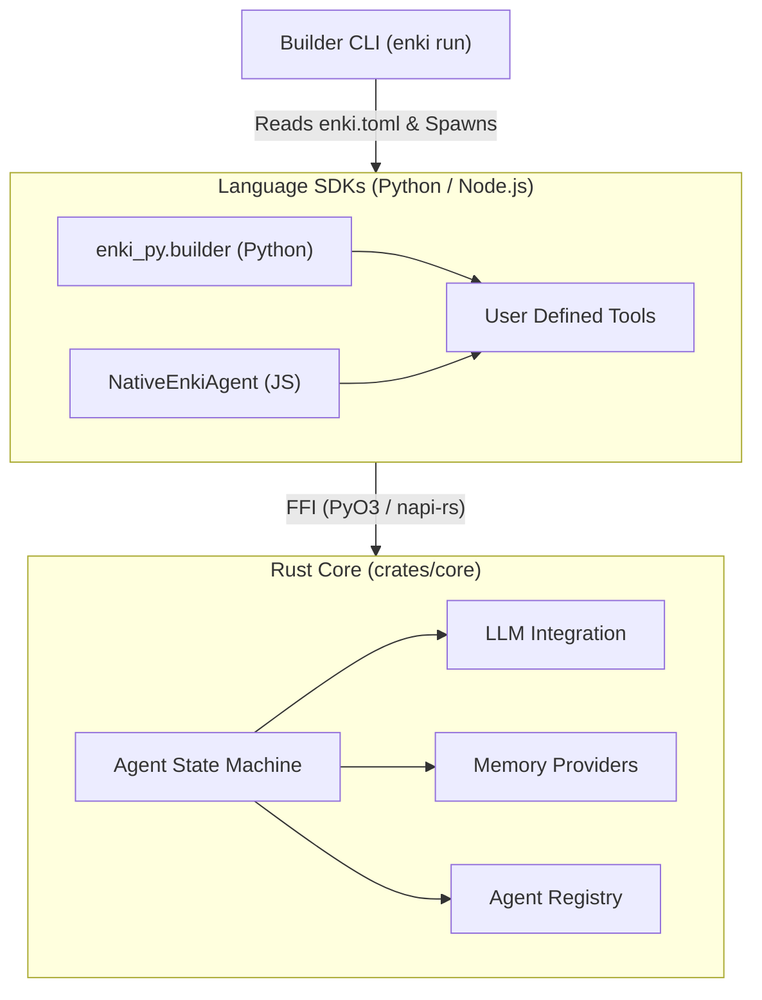
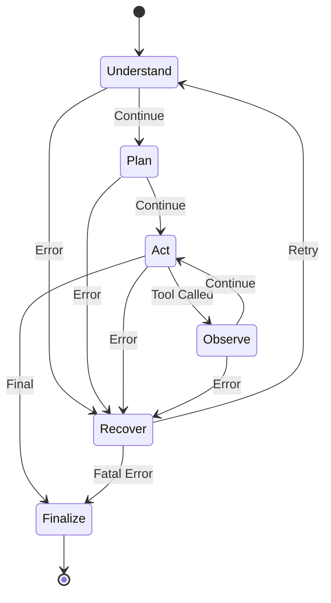
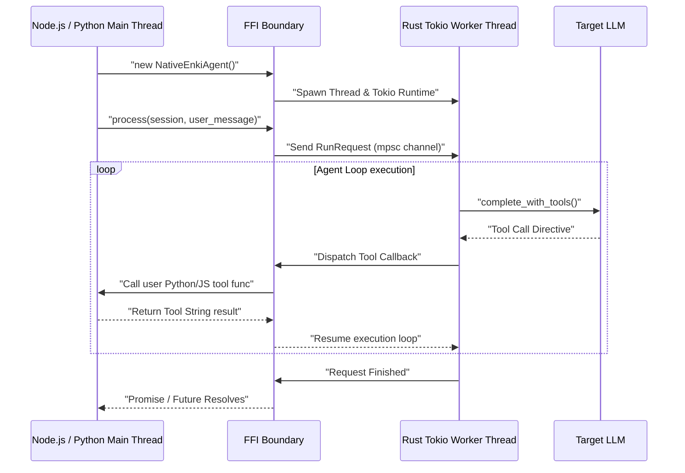

# Enki Framework: Full Architecture Guide

This document is a comprehensive guide to the internal architecture of the Enki framework. Enki is designed as a polyglot multi-agent framework where the heavy lifting (execution loops, concurrency, state management) is written in Rust (`core`), while providing ergonomic bindings for high-level languages like Python and Node.js (`bindings`).

---

## 1. System Philosophy

The fundamental design philosophy of Enki is **"Rust for performance and determinism, SDKs for extensibility."**

By maintaining the control loop in Rust, we ensure:
- Extremely strict and predictable agent state machines.
- Safe concurrency models when executing multiple agents.
- Uniform observability (tracing) across all language targets.

The architecture is divided into three primary crates:
1. `crates/core`: The pure Rust engine containing all logical abstractions.
2. `crates/bindings`: FFI layers (`napi-rs` for Node, `PyO3` for Python) wrapping the core.
3. `crates/builder`: A CLI that orchestrates local developer workflows (`enki.toml`).

---

## 2. Core Engine (`crates/core`)

### The State Machine: `AgentLoop`
At the very center of Enki is `DefaultAgentLoop` inside `core/src/agent/agent_loop.rs`. It does not trust the LLM implicitly. Instead, it processes execution as a strict State Machine defined by the `LoopPhase` enum.

**How it works:**
1. **Initialize**: A session context and `ExecutionState` (budget, retries) are loaded.
2. **Execute Turn**: The LLM is invoked. The resulting `StepOutcome` is translated by the loop into a `LoopDirective`.
3. **Handle Directive**:
   - `Continue(next_phase)`: Advances the state machine.
   - `Retry`: Increments `budget.retries`. If it exceeds limits, hard fails. Otherwise, falls back to `Recover` phase.
   - `Final`: Halts execution and commits memory.

### Pluggable Abstractions
The agent itself (`Agent`) is highly modular, depending on interfaces rather than implementations:
- **`LlmProvider`**: Abstraction over the LLM. Enki allows bindings to inject virtual LLM providers that route requests out to Python or Node.js logic.
- **`MemoryProvider` & `MemoryRouter`**: Pluggable long-term context.
- **`ToolRegistry` & `ToolExecutor`**: Centralized mapping of available functions.

### Observability
The core loop defines `ExecutionStep` instances that track index, phase, kind, and detail. These trigger `on_step` callbacks, bubbling up through the FFI boundary synchronously to provide real-time terminal or UI streaming in any language.

---

## 3. Multi-Agent Ecosystem (`crates/core/src/runtime`)

Enki natively scales from a single `Agent` to a distributed `MultiAgentRuntime`.

### `AgentRegistry`
When the Multi-Agent runtime starts, every agent registers an `AgentCard` describing its ID, name, status (`Online/Offline/Busy`), and semantic capabilities (`code-gen`, `search`, etc.).

### Intrinsic Delegation Tools
The multi-agent runtime automatically injects foundational tools into all agents:
1. **`DiscoverAgentsTool`**: Plugs into the LLM, allowing it to dynamically query the registry.
2. **`DelegateTaskTool`**: Allows an agent to spin up an isolated session context targeted at another agent. The delegated task runs natively in its own thread/loop, safely isolated from the calling agent's context.

---

## 4. Bindings Architecture (`crates/bindings`)

The most complex and powerful part of Enki is how it exposes the Rust runtime to Garbage-Collected languages without compromising thread safety.

**Key implementations:**
- `enki-js` uses `napi-rs` and `ThreadsafeFunction`.
- `enki-py` uses `PyO3` and raw thread polling.

### The Tokio Worker Thread Pattern
Languages like JavaScript are strictly single-threaded (per isolate), and Python relies heavily on the Global Interpreter Lock (GIL). You cannot safely run a blocking Rust asynchronous loop on the main thread.

To solve this, Enki uses the **Worker Thread Pattern**:
1. When an `EnkiAgent` is instantiated in JS/Python, Rust spawns a dedicated background OS thread.
2. Inside this thread, a completely fresh, isolated `tokio::runtime` is established.
3. A heavily protected `mpsc::channel` (Message Passing) is established between the host language thread and the Tokio runtime.

### Trait Translation (Callbacks)
When an agent calls a tool that was written in Python, the Rust Engine hits an FFI wall. Enki solves this via "Bridging Traits":
- It implements pure Rust versions of `Tool`, `MemoryProvider`, etc., like `PythonTool` or `JsMemoryProvider`.
- When `execute()` is triggered on the Rust side, the bridge struct serializes the context and fires a thread-safe callback *across* the boundary back to Node/Python.
- In Node, `ThreadsafeFunction` schedules the invocation on the V8 event loop.
- The Rust loop `.await`s the result safely without freezing the host language block.

---

## 5. The Builder CLI (`crates/builder`)

The CLI (`enki.toml`) is the developer interface that knits everything together into an ergonomic local environment.

### Project Composition
`manifest.rs` maps a desired environment configuration into a deployable schema.

### Dynamic Embedded Execution
To achieve zero-friction usage (`enki run`), the Rust CLI acts as an orchestrator. If the project type is Python:
1. `project_runtime.rs` automatically walks the tree to locate a local `.venv` or global system python.
2. It executes a pre-built internal stub (`enki_py.builder`).
3. It passes the **entire manifest configuration** (Agents, Tools logic, models) via a highly compressed, serialized CLI argument vector to avoid writing temp files.

### Introspection Magic
Inside `enki_py.builder`, Python uses `importlib` and `inspect.signature` to parse user-defined tools. It automatically detects if a tool needs standard `args` or deep Enki `Context`, wraps it transparently, attaches it to the FFI `Agent` layer, and starts the internal stream.

---

## Summary

`enki` achieves high performance and reliability through a strictly typed Rust state machine, while offering infinite extensibility through safe FFI threading models. The Builder CLI completes the package by abstracting these complex integration points entirely away from the end developer.
